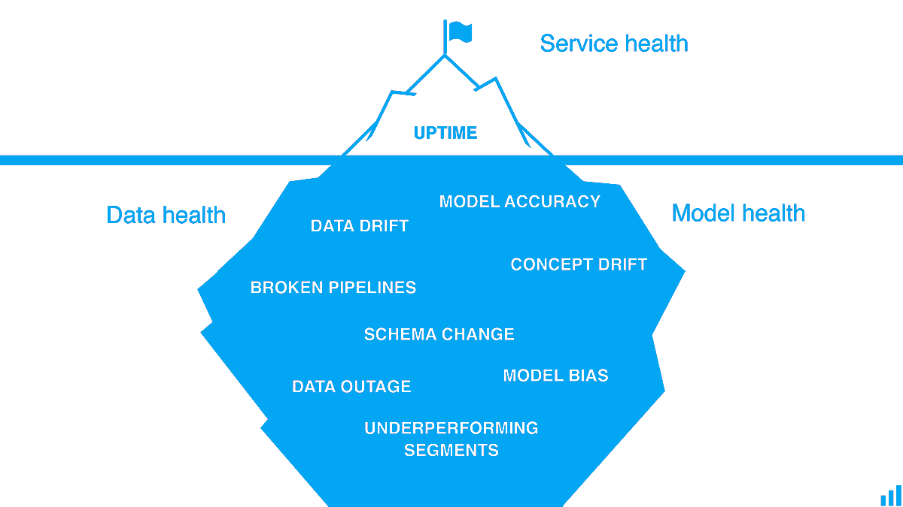

# Continuous Monitoring
Machine Learning models are unique software entities as compared to traditional code and their performance can fluctuate over time due to changes in the data input into the model after deployment. So, once a model has been deployed, it needs to be monitored to assure that it performs as expected.

It is also necessary to emphasize the importance of monitoring models in production to avoid discriminatory behavior on the part of predictive models. This type of behavior occurs in such a way that an arbitrary group of people is privileged at the expense of others and is usually an unintended result of how the data is collected, selected and used to train the models. 

Therefore, we need tools that can test and monitor models to ensure their best performance, in addition to mitigating regulatory, reputation and operational risks. 

## What to Monitor?
The main concepts that should be monitored are hte following:

1. __Performance__: Being able to evaluate a model’s performance based on a group of metrics and logging its decision or outcome can help give directional insights or compared with historical data. These can be used to compare how well different models perform and therefore which one is the best.

2. __Data Issues and Threats__: Modern models are increasingly driven by complex feature pipelines and automated workflows that involve dynamic data that undergo various transformations. With so many moving parts, it’s not unusual for data inconsistencies and errors to reduce model performance, over time, unnoticed. Models are also susceptible to attacks by many means such as injection of data.

3. __Explainability__: The black-box nature of the models makes them especially difficult to understand and debug, especially in a production environment. Therefore, being able to explain a model’s decision is vital not only for its improvement but also for accountability reasons, especially in financial institutions.

4. __Bias__: Since ML models capture relationships from training data, it’s likely that they propagate or amplify existing data bias or maybe even introduce new bias. Being able to detect and mitigate bias during the development process is difficult but necessary.

5. __Drift__: The statistical properties of the target variable, which the model is trying to predict, change over time in unforeseen ways. This causes problems because the predictions become less accurate as time passes, producing what is known as [concept drift](https://link.springer.com/article/10.1023%2FA%3A1018046501280). 

The following drawing[^1] shows that the health of a Machine Learning system relies on hidden characteristics that are not easy to monitor therefore using the analogy of an iceberg.

[^1]: Image from KDnuggets blog post "A Machine Learning Model Monitoring Checklist: 7 Things to Track". https://www.kdnuggets.com/2021/03/machine-learning-model-monitoring-checklist.html

## Popular Serving and Monitoring Tools
Most tools used for serving Machine Learning models have monitoring tools. In many suites like IBM Watson, Microsoft Azure and Amazon Sagemaker there is components entirely dedicated to monitoring, like IBM Watson OpenScale. In the following table we can see some of the most popular monitoring tools for machine learning models.

| Tools                | License           | Developer  | Observations |
| -------------------- |:-----------------:|:----------:|:------------ |
| IBM Watson OpenScale | Proprietary        | IBM        | Monitors models deployed to IBM Watson Machine Learning. Monitors fairness, explainability and drift. Has tools for managing and correcting problems or inaccuracies in production.
| OpenShift            | Open-source        | Red Hat    | Kubernetes based system able to deploy various types of applications. It is platform agnostic and can be used for any type of application. Can be useful when a model is heavily integrated into a microsservice environment.|
| Seldon Core          | Open-source        | SeldonIO   | Deploys models into microsservices with Advanced Metrics, Request Logging, Explainers, Outlier Detectors, A/B Tests, Canaries and more. Platform agnostic and works with many Machine Learning frameworks |
| Tensorflow Extended (TFX) | Open-source        | Tensorflow | Deploy Tensorflow Models as API and has monitoring capabilities. |